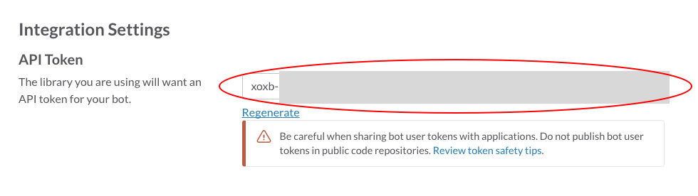

# Slack API Token

- Add the [bot integration](https://tbwns.slack.com/apps/A0F7YS25R-bots) to your slack team.
- Copy the **API Token*



- Add the token to a `.env` file

```sh
echo "SLACK_TOKEN=[PASTE TOKEN HERE]" > .env
```
